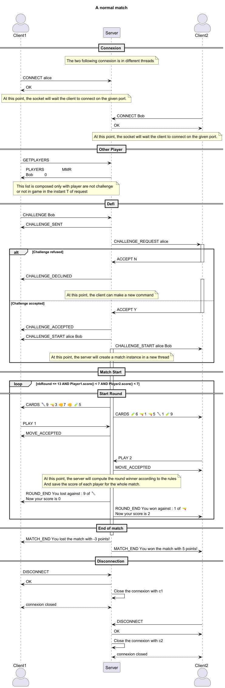
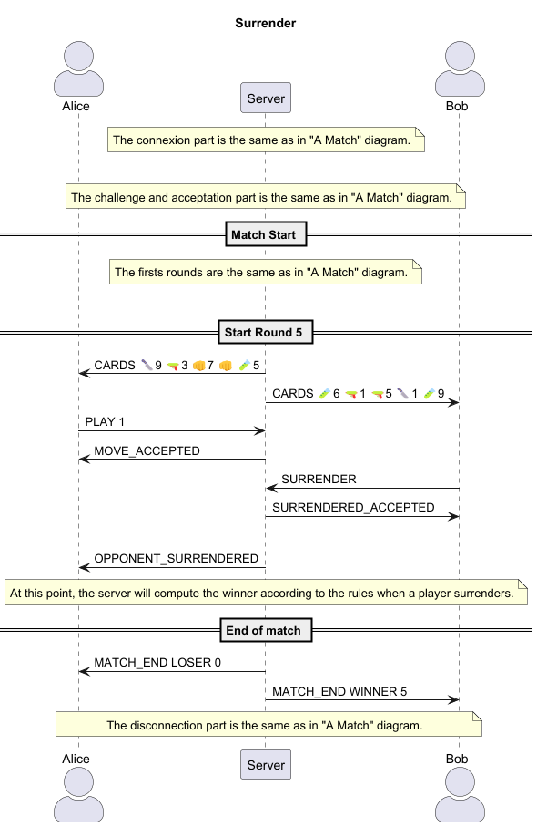
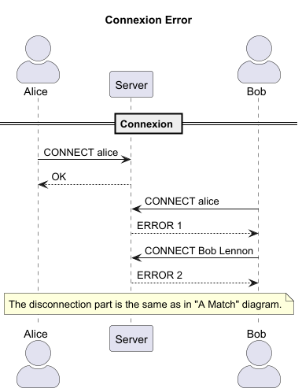
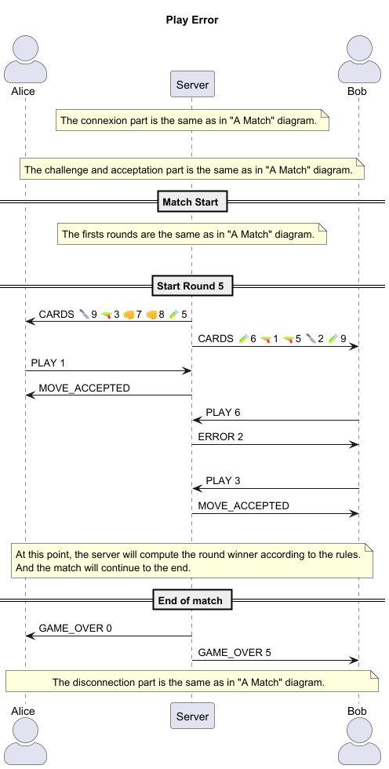

# CardBattle Protocol

## Section 1 - Overview

The CardBattle protocol is a text-based (UTF-8) application protocol for an online card game in client/server mode. It allows clients to connect, list available players, send challenges, accept/decline, play cards, surrender, and disconnect.

## Section 2 - Transport Protocol

- Transport: TCP
- Server port: 6433 (default, configurable)
- Encoding: UTF-8
- The client initiates the connection.
- After connecting, the client exchanges text messages with the server.
- The server can close the connection at any time (e.g. disconnection).
- Messages are formed by the server, except for two commands that are client-side only (HELP and RULES).

Authentication/identification:
- The client must identify itself via `CONNECT <username>` before using most commands.
- Usernames must be unique on the server and have max 12 chars.

## Section 3 - Messages

Messages sent by the client and server are lines of text. General format: `COMMAND [arg1] [arg2] ...`

### Connection

Message:
```
CONNECT <username>
```

Response:
- `OK`: connection accepted
- `ERROR <message>`:
    - `NO NAME PROVIDED` : no username provided
    - `NAME IN USE` : username already in use
    - `INVALID NAME` : username contains invalid characters (no spaces allowed)

### Disconnection

Message:
```
DISCONNECT
```

Response:
- `OK`: disconnection accepted (server closes connection)
- `ERROR <message>`:
    - `NOT AUTHENTICATED`: not connected

### List available players

Message:
```
GETPLAYERS
```

Response:
- `PLAYERS <player1> <player2> ...`: list of available players (not in a match, not on standby)
- `PLAYERS_EMPTY`: no players available
- `ERROR <message>`:
    - `NOT AUTHENTICATED`: not connected

### Send a challenge

Message:
```
CHALLENGE <targetPlayer>
```

Immediate response to the requester:
- `CHALLENGE_SENT`: request sent
- `ERROR <message>`:
    - `NOT AUTHENTICATED`: not connected
    - `TARGET NOT FOUND`: target player given
    - `USER NOT FOUND`: target player does not exist
    - `NO CHALLENGING SELF`: cannot challenge oneself
    - `TARGET NOT AVAILABLE`: target player is not available (in match or on standby)
    - `CHALLENGE ALREADY SENT`: challenge already sent to this player

Notification sent to the target:
- `CHALLENGE_REQUEST <fromPlayer>`

### Response to the challenge

Message (sent by the target):
```
ACCEPT y
```
or
```
ACCEPT N
```

Server behaviour:
- If `y`: `CHALLENGE_START <player1> <player2>` is sent to both players and game initialisation.
- If `N`: `CHALLENGE_DECLINED <fromPlayer>` sent to the challenger.

Response to the target:
- `CHALLENGE_ACCEPTED`: challenge accepted and game starting
- `CHALLENGE_DECLINED`: challenge declined

Response:
- `ERROR <message>`:
  - `NOT AUTHENTICATED`: not connected
  - `NO CHALLENGE SET`: no challenge to respond to
  - `NO RESPONSE GIVEN`: no response provided

### Play a card

Message:
```
PLAY <cardNum>
```
- `cardNum`: integer between 1 and 5 corresponding to the position in the hand

Response:
- `MOVE_ACCEPTED <cardNum>`: move accepted
- `ERROR <message>`:
    - `NOT AUTHENTICATED`: not connected
    - `NOT IN MATCH`: not in game
    - `NO CARD GIVEN` : no card number provided
    - `INVALID PLAY`: invalid card number (not between 1 and 5)

### Abandon / Surrender

Message:
```
SURRENDER
```

Response:
- `SURRENDERED`: action accepted, game over (loser = the one who surrenders)
- `ERROR <message>`:
    - `NOT AUTHENTICATED`: not connected
    - `NOT IN MATCH`: not in game

Message sent to the opponent:
```
OPPONENT_SURRENDERED
```

### Match MSG
Message:
```
MATCH_MSG <message>
```
- `message`: text message to send to the opponent

Response:
- `MSG SENT`: message sent
- `ERROR <message>`:
    - `NOT AUTHENTICATED`: not connected
    - `NOT IN MATCH`: not in game
    - `NO MESSAGE GIVEN`: no message provided

The opponent receives:
```
MATCH_MSG FROM <username> : <message>
```

### Command only client side

#### Rules

Message:
```
RULES
```

Response:
- print of the game rules

#### Help
Message:
```
HELP
```

Response:
- print the list of available commands

### Server notifications
#### Receiving the hand of cards

Message (Server -> Client):
```
CARDS <card1> <card2> <card3> <card4> <card5>
```
- `cardX`: format `<type><value>` where :
  - `type` is a character from {🔪, 🔫, 👊, 🧪}
  - `value` is an integer between 1 and 9.

#### End of round

Message (Server -> Client):
```
ROUND_END You <won / tied / lost> against : <CARD VALUE> of <CARD TYPE> \nNow your score is <SCORE>
```
- `won` : in case of victory the match (players with the highest score)
- `tied` : in case of egal score
- `lost` : in case of not victory (the lowest score)
- `CARD VALUE` : the value of the card played by the opponent.
- `CARD TYPE` : the type of the card played by the opponent.
- `SCORE`: the number of point in the match.

#### End of match

Message (Server -> Client):
```
MATCH_END You <won / tied / lost> the match with <SCORE> points
```
- `won` : in case of victory the match (players with the highest score)
- `lost` : in case of not victory (the lowest score, surrender or after 13 rounds)
- `tied` : in case of egal score
- `SCORE`: the number of point in the match.

### Invalid command

If the server receives a malformed or unknown command:
- Response: `INVALID_COMMAND`

## Section 4 - Examples

### Functional example (sequence of messages)



### Example with surrender


### Example: Username already in use


### Error: playing an invalid card
